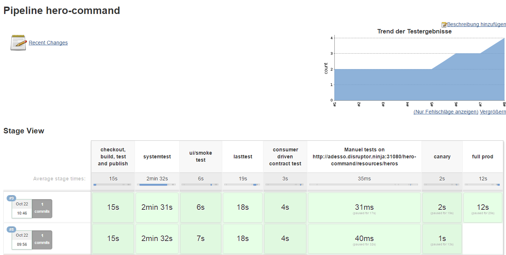

class: center, middle

# Microservices mit Docker und Kubernetes
## Einleitung & Kursübersicht

---

# Inhalt

* Demo
* Entwickeln & Fragen
* Fragen & Entwickeln

[Link zur Präsentation](https://rawgit.com/robertbrem/Microservices_mit_Docker_und_Kubernetes/master/Einleitung/Praesentation.html)  
Pattern:  
rawgit.com/robertbrem/Microservices_mit_Docker_und_Kubernetes/master/  
**Einleitung/Praesentation.html**

---
class: center

# Demo

.image-75[
  [](http://adesso.disruptor.ninja:30180)
]

---

# Aufgabe 1

## Basic Tools installieren
[GIST](https://gist.github.com/robertBrem/2b382911e967692e240f)  
Testen ob es funktioniert hat:
```bash
rob@teama:~/Desktop$ ansible --version
ansible 2.2.0.0
  config file = /etc/ansible/ansible.cfg
  configured module search path = Default w/o overrides
```
Git installieren:
```bash
sudo apt-get update && sudo apt-get install git -y
```

---

# Aufgabe 2

## Bevorzugte Entwicklungsumgebung aufsetzen
Seine bevorzugten Entwicklungsumgebung und Tools installieren, z.B. mit Ansible:  
Ansible Repository für diesen Kurs clonen.
```bash
git clone https://github.com/robertBrem/Microservices_Ansible_Setup
```
Im File `playbooks/basicSetUp.yml` die Tools die man nicht installieren möchte kommentieren (`#`). Danach die Installation starten:
```bash
sudo ansible-playbook playbooks/basicSetUp.yml
```

---

# Aufgabe 3

## REST Service erstellen
Einen REST Service mit seiner bevorzugten Programmiersprache und Framework implementieren.
